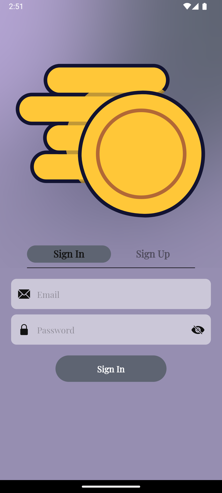
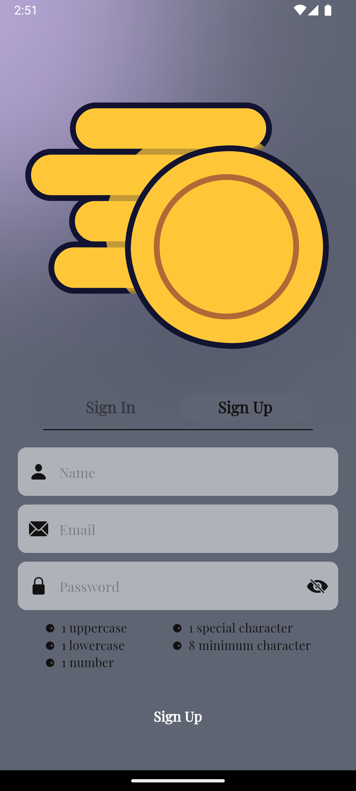
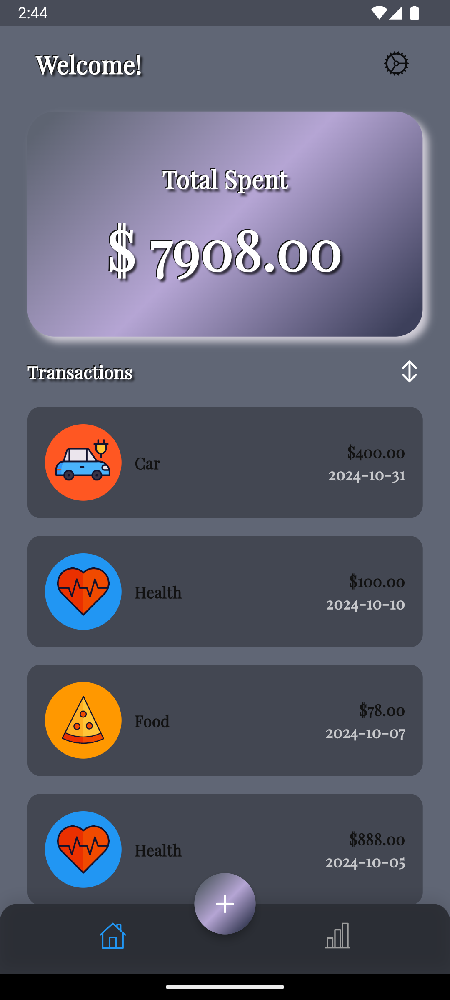
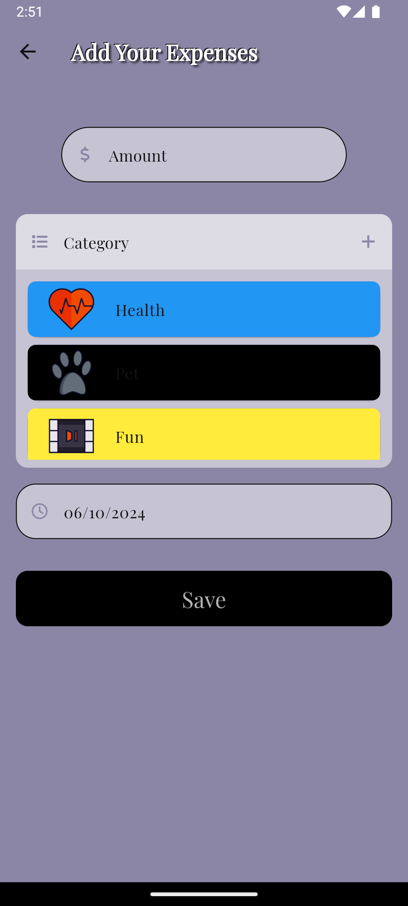
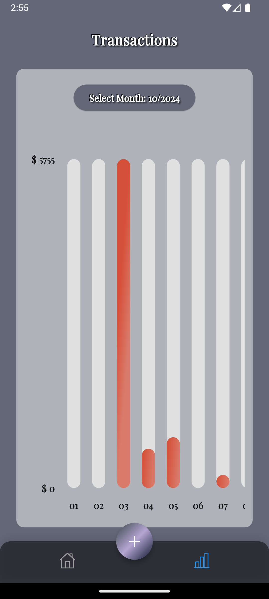

# Expenses Tracker

## Overview

This project is an Expenses Tracker application that allows users to efficiently manage their finances. Users can add, and categorize their expenses while gaining insights through data visualization. The app aims to provide a user-friendly interface for tracking daily expenses and monitoring financial health.

## Table of Contents

- [Features](#features)
- [Architecture](#architecture)
- [UI/UX Design](#uiux-design)
- [Project Timeline](#project-timeline)
- [Usage Instructions](#usage-instructions)
- [Screenshots](#screenshots)
- [Project Structure](#project-structure)
- [Technologies Used](#technologies-used)
- [Setup Instructions](#setup-instructions)

## Features

### User Registration

- **User Authentication**: Secure login and registration process using Firebase Authentication.

### Expenses Management

- **Add Expenses**: Users can easily add their expenses.
- **Categorization**: Users can categorize expenses (e.g., Food, Pet, Entertainment, etc).

### Data Visualization

- **Charts**: Visualize spending patterns and daily expenses through bar charts.

### Syncing and Storage

- **Local and Remote Storage**: Store data locally and sync with Firebase Firestore for real-time updates.

## Architecture

### Architecture Pattern

- **BLoC**: The app follows the BLoC (Business Logic Component) pattern for business logic and state management, ensuring a clear separation of UI and business logic.

### Backend

- **Firebase**: The backend services are powered by Firebase, handling user authentication, Firestore for data storage.

### Frontend

- **Flutter**: The frontend is built using Flutter with a declarative UI structure, ensuring that the UI reacts to changes in the underlying state seamlessly.

### State Management

- **Streams in BLoC pattern**: State management is achieved through Streams in the BLoC pattern, allowing for asynchronous event-driven interactions between the UI and business logic.

### Data Layer

- **Models**: The app features well-structured data models for handling **User**, **Expense**, and **Category** entities.

### Data Model

- **User**: Represents user data including email, authentication status, and preferences.
- **Expense**: Represents expense data, including amount, category, and date.

### Data Management

- **Firebase Firestore**: For managing user data and expenses with real-time synchronization.

## UI/UX Design

The app's design adheres to Material Design guidelines, providing a clean and intuitive interface that enhances user experience across various devices.

**Figma Prototype**: *https://www.figma.com/design/2FEybq5L0SFPx1CsIZgd7X/Expenses-Tracker?node-id=1-21&node-type=instance&t=rphreRg8abd6lPOV-0*

### Project Timeline

The development of this Expenses Tracker application follows a detailed project timeline to ensure steady progress, track features, and handle task management efficiently. You can view the complete project timeline, including the current status of tasks, upcoming features, and bug tracking on my Trello board.

**Trello Board**: *https://trello.com/invite/b/66e8dfcd5ab3e2dbf09bcf2e/ATTI62dd63669011a083a46e4eed0cd2504f0FDD7BF8/expenses-tracker*

### Usage Instructions

- **User Registration**: Register for a new account using email and password.
- **Add Expenses**: Use the add expense screen to input expense details.
- **View Expenses**: Access the home screen to see a list of recorded expenses categorized by type.
- **Visualize Data**: Use the visualization screen to analyze spending trends and patterns.

### Screenshots

#### Sign In Screen



#### Sign Up Screen



#### Home Screen



#### Add Expenses Screen



#### Stats Screen



#### Profile Screen


### Technologies Used

- **Dart**
- **Flutter**
- **Firebase Firestore**
- **Material Design**
- **FL Chart**

## Setup Instructions

### Prerequisites

- **Flutter SDK**: Ensure you have the Flutter SDK installed.
- **Firebase Project**: Create a Firebase project and connect it to the app.
- **Git**: Ensure Git is installed for version control.

### Installation

1. **Clone the repository**:

   ```bash
   git clone https://github.com/your-username/expenses_tracker.git
   cd expenses_tracker

   ```

2. **Open in IDE**:
   Open the project in your preferred IDE (e.g., Android Studio or VS Code).

3. **Connect Firebase**:

   Add the google-services.json file for Android and GoogleService-Info.plist for iOS.
   Set up Firebase Authentication and Firestore in the Firebase console.

4. **Build the project**:
   ```bash
   flutter pub get
   flutter run
   ```
